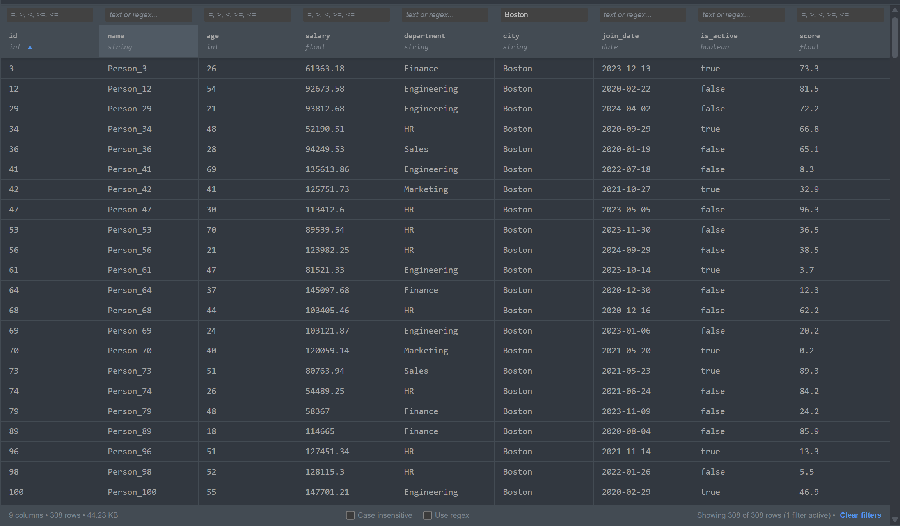

# jupyterlab_parquet_viewer_extension


[](https://www.npmjs.com/package/jupyterlab_parquet_viewer_extension)
[](https://pypi.org/project/jupyterlab-parquet-viewer-extension/)


JupyterLab extension for browsing Parquet files with filtering, sorting, and search capabilities. Opens Parquet files directly in JupyterLab without writing code, providing spreadsheet-like interaction for columnar data.



## Features

- Progressive loading (500 rows initially, expands on scroll) for responsive performance with large files
- Column sorting with three-state toggle (ascending, descending, off)
- Per-column filtering with substring or regex pattern matching
- Case-insensitive search option
- Numerical filters supporting comparison operators (`>`, `<`, `>=`, `<=`, `=`)
- File statistics display (column count, row count, file size)
- Clear filters functionality to reset all active filters
- Column headers showing field names with simplified datatype indicators
- Automatic column width optimization
- Server-side processing maintains performance with large datasets
- Read-only interface focused on data exploration

## Installation

Requires JupyterLab 4.0.0 or higher.

```bash
pip install jupyterlab_parquet_viewer_extension
```

Uninstall:
```bash
pip uninstall jupyterlab_parquet_viewer_extension
```

## Troubleshooting

Verify both extension components are enabled if the extension doesn't work:

```bash
# Check server extension
jupyter server extension list

# Check frontend extension
jupyter labextension list
```

Both commands should show `jupyterlab_parquet_viewer_extension` as enabled. Reinstall if either is missing or disabled.

## Development Setup

Requires NodeJS for building TypeScript frontend. Uses `jlpm` (JupyterLab's pinned yarn version) for consistency.

**Initial setup:**

```bash
# Create virtual environment
python -m venv .venv
source .venv/bin/activate

# Install in editable mode
pip install --editable ".[dev,test]"

# Link frontend and enable server extension
jupyter labextension develop . --overwrite
jupyter server extension enable jupyterlab_parquet_viewer_extension
```

**Development workflow:**

Use two terminals for efficient development:
- Terminal 1: `jlpm watch` (auto-rebuild on file changes)
- Terminal 2: `jupyter lab` (run development instance)

Refresh browser after changes to see updates. Build generates source maps for debugging.

Enable deeper debugging with unminimized JupyterLab build:
```bash
jupyter lab build --minimize=False
```

**Removing development installation:**

```bash
jupyter server extension disable jupyterlab_parquet_viewer_extension
pip uninstall jupyterlab_parquet_viewer_extension
```

Then delete the `jupyterlab_parquet_viewer_extension` symlink from your `labextensions` directory (find with `jupyter labextension list`).

## Testing

Three-tier testing strategy: Python backend, TypeScript frontend, and integration tests.

**Python tests** (pytest with coverage):
```bash
pip install -e ".[test]"
jupyter labextension develop . --overwrite
pytest -vv -r ap --cov jupyterlab_parquet_viewer_extension
```

**TypeScript tests** (Jest):
```bash
jlpm
jlpm test
```

**Integration tests** (Playwright + Galata):
Simulates real user interactions to validate complete workflows. See [ui-tests README](./ui-tests/README.md) for detailed instructions.

## Packaging and Release

See [RELEASE.md](RELEASE.md) for instructions on building distributable packages and publishing releases.
